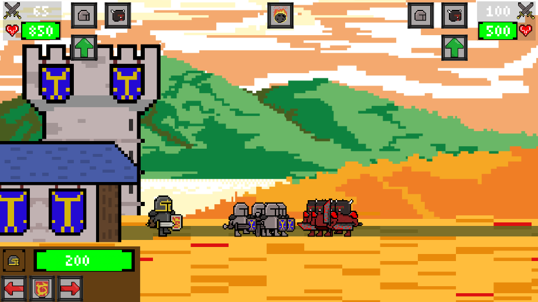

BOTL – Battle of the Land
============================

Description:
------------
BOTL is a real-time strategy game inspired by classics such as Age of War and Clan Wars: Goblin Forest. Developed as a passion project by an indie developer working in his free time, BOTL combines strategic unit management, hero customization, dynamic spellcasting, and building upgrades—all presented in a 2D pixel art style (temporary).

Features:
---------
- Real-Time Strategy: Command your units, hero, and buildings against an opposing team.
- Unit Diversity: Manage various units with unique abilities and upgrades.
- Customizable Heroes: Choose and upgrade your hero, a key element on the battlefield.
- Dynamic Spells: Cast a variety of spells with multiple effects (damage, push, healing, etc.) that influence the battle.
- Building Upgrades: Enhance your castle and buildings to improve resource generation and defense.

Installation:
-------------
1. Clone the Repository:
   git clone https://github.com/yourusername/BOTL.git

2. Open in Unity:
   Use Unity version 2022.3.9f1 (or later) to open the project.

3. Setup:
   Ensure that all required Unity packages are installed.

4. Run:
   Build and run the project for PC (a mobile port is planned for the future).

How to Play:
------------
- Pre-Game Setup: Choose your faction, hero, units, and spells in the pre-game menu.
- Battle: Engage in strategic battles where timing, positioning, and upgrades determine victory.

Development Roadmap:
--------------------
- Optimization & Refactoring: Continue to improve code performance and modularity.
- Multiplayer Integration: Add support for local/online multiplayer matches.
- Content Expansion: Introduce new units, heroes, spells, and building types.
- Visual Style Refinement: Define and establish the final art direction, moving beyond the current temporary pixel art style.
- Mobile Port: Adapt the game for mobile platforms.

License:
--------
This project is licensed under the MIT License. See the LICENSE file at the root of the repository for full details.

Contact:
--------
For any questions or suggestions, please use the GitHub Issues section or contact the developer at celian57@outlook.fr.
